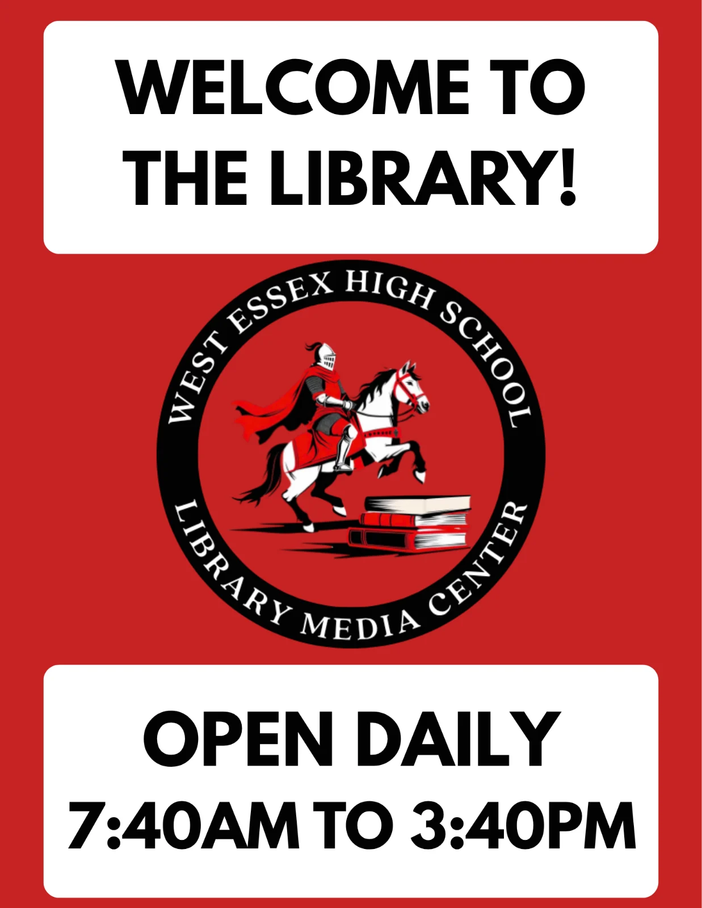
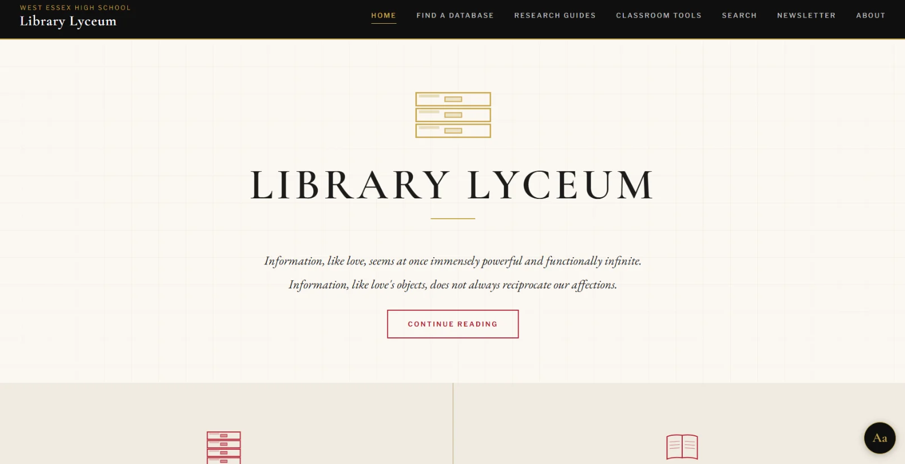

 by Arthur Dove (American, 1880-1946)")

Welcome back! I'm Mr. Thompson, your steadfast librarian, writing on behalf of the West Essex High School Library, and this is *Knightly Muse*, a newsletter I intend to post at regular intervals moving forward. I hope you're settling in following the hubbub of the first week and look forward to corresponding with you. Students are always welcome to reply to this newsletter with questions, considerations, and reactions of any kind. My inbox is always open!

Onward. In our flagship missive, we'll review a few library basics, introduce a new library website, and share a provocation. Let's get it!

---

## Library Hours

Have you stopped in this school year? Our library is open before and after school every day with a handful of exceptions.

The library will close before school if...
- ...I'm not here.

The library will close after school if...
- ...we're following a half-day/single session schedule.
- ...teachers are attending a Monday faculty meeting.

That's the long and the short of it. I look forward to seeing you!

---

## Formal Library Policies

Library policies are also available on the district's [library website](https://hs.westex.org/academics/library),  but are reposted here for ease of reference.

To offer my gloss of these rules: always use a Securly pass during the school day, make sure you have your ID at all times, and treat our shared space and one another with the care and affection befitting such precious resources. As to particulars:

## Visiting the Library: A Few Gentle Reminders
- The Library is a shared, safe, and inclusive space accessible to everybody in our learning community.
- Outside of instructional time, students are encouraged to use the Library for study, research, and recreational reading.
 
## Library Etiquette
- If you need help with anything—anything!—just ask.
- During instructional time, work quietly. Do not disturb in-session classes or other library users.
- Beverages in secure containers are permissible; food is prohibited.
- Strive to return borrowed materials promptly.
- Clean up after yourself before leaving.
 
## Class, Lunch, and Study Hall Visitors
- Regardless of the time or reason, students must present a physical ID to enter the library.
- During instructional time, students cannot enter without a Securly pass.
- The librarian encourages lunchtime visitors to plan on eating in the cafeteria before or after stopping in.
- The librarian reserves the right to restrict the number of students entering during lunch.
- Students coming from Study Hall must remain in the Library for the rest of the period. The librarian reserves the right to restrict the number of students entering from study hall.

---

## Library Lyceum {Our Digital Library Hub}

I'm thrilled to debut the [West Essex High School Library Lyceum](https://mistertlibrary.github.io/librarylyceum/index.html), a new library website intended to serve as a repository for our ever-expanding digital offerings. The site's name invokes two ancestors. 

Students of the first, Aristotle’s school in ancient Athens, pursued philosophy peripatetically, moving literally and figuratively between questions. Our library also ambles about, tirelessly walking down satisfying answers to complicated questions; our library also realizes a host of further inquiries lurks between the syllables of any given answer.

Educators of the second, America's 19th century Lyceum movement, brought serious ideas to public audiences outside academia. Our library also believes the pursuit of knowledge belongs to everyone, regardless of credential, station, social status, or present course of study.

This hub anchors our network of research guides, instructional resources, and databases. Each component of the Lyceum is built around a specific course, assignment, or question. Each serves as a map through unfamiliar territory, and, like any map worth its vellum, proves most useful after you realize the territory itself takes priority over any abstraction.

More on the Lyceum in future newsletters and classes as the year progresses!

---

## What Are You Doing Here?: A Provocation

 by Levi Walter Yaggy (American, 1848 - 1912)")

As we begin a new year, I thought I might share a few notes from a recent essay in [Asterisk magazine](https://asteriskmag.com/issues/15/saving-academics-from-themselves) titled "Saving Academics from Themselves." The author, Kevin Munger, is an computational social scientist; in this piece, he treats the contrasting value systems of  Silicon Valley and academia as a departure point for his thoughts on acquiring, integrating, producing, and sharing information.

Epistemology—the study of what we think we know and why we think we know it—is a common denominator in much of what I do as a librarian. While Munger's thoughts specifically concern advanced studies, the epistemological issues he explores are just as pressing at the high school level (and below!). For instance:

> Speaking for my field: Unless academics can design and implement major reforms to our research practice in the next few years, there is a real risk that many social science professors will want to ban AI entirely. Soon we’ll be forcing each other to sign statements swearing that we didn’t use AI and AInvestigating not just every em-dash, but every semicolon and three-part list, too. To do so would make academics a sort of dockworkers union of knowledge, preventing the adoption of more efficient technology for doing research in order to preserve their current way of life.

This needless cycle of dissemblance, accusation, and counter-accusation is just as pressing (and annoying) in secondary schools as it is among credentialed professionals. We, too, must decide how we wish to navigate a world where dissemblance is effortless and information overwhelms.

Do I agree with everything the essay argues? Absolutely not. Do I think it broaches interesting questions and contributes to an important conversation? I do. (Never forget that an [essay](https://www.websters1913.com/words/Essay) is literally a try, an attempt, a reckoning with a topic that isn't intended to be the final word.) Consider a few of the deep epistemological questions the essay implies:
- What types of knowledge and learning should schools value as digital technologies advance?
- Rather than completely abstaining from AI use, how can academics maintain their autonomy while applying its strengths to their work?
- How can institutions incentivize researchers to read and integrate the vast body of extant research rather than focusing on producing new material?
- Where and how should academics convey their findings and expertise to a general public?

What are educators supposed to convey to their students: specific skills, subject area knowledge, general ways of thinking, ethical ways of being? Which of these categories do their assignments and class structures seem to prioritize?

Aside from college and career, what are students preparing themselves for? Are they in high school to produce work (create content?) or to learn how to judge it? How committed are they to putting in the time necessary to develop and refine their own taste and abilities?

When you draft an essay, break down an equation, write a lab report, or analyze a historical figure, is it more important to produce impressive work or to experience the generative friction of struggling to it? Do you approach wood shop, culinary class, art, music, or gym with the same mindset and standards that you apply to the core academic subjects? Why or why not?

Is there much value in providing a correct answer or strong argument, but crumbling beneath an iota of scrutiny? In an age of easy answers, perhaps we should rededicate ourselves to asking better questions not only of the information at hand, but our own rationale for obtaining it.

---

Excelsior,

Mr. T
